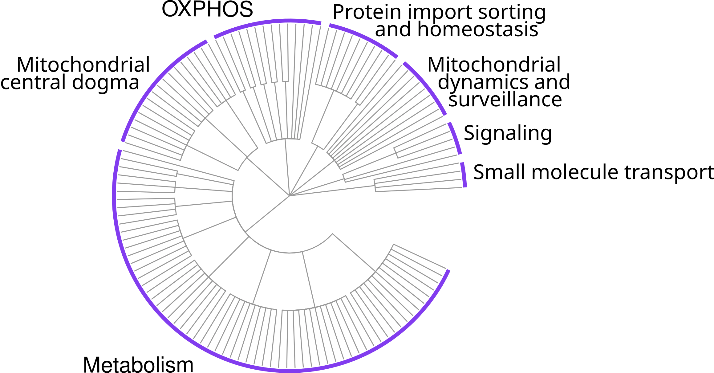
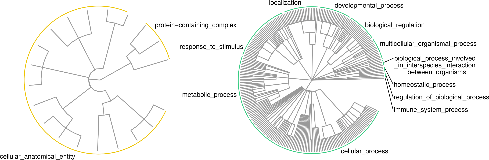
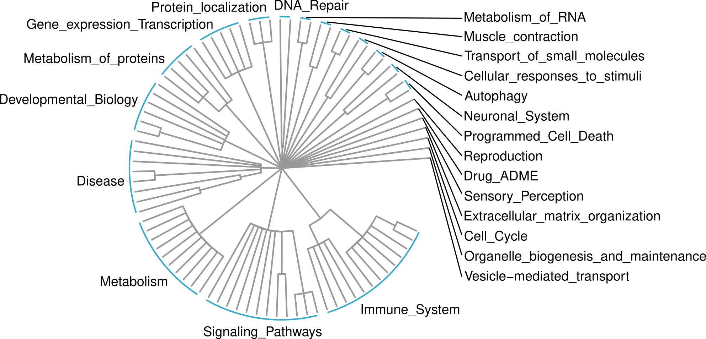

```{r setup, include = FALSE}
knitr::opts_chunk$set(echo = TRUE, fig.wide = TRUE)
```

# Introduction
Mitochondria are cellular organelles whose main role is related to the aerobic respiration to supply energy to the cell. In addition to this, they are also involved in other tasks, such as signaling, cellular differentiation, and cell death, as well as maintaining control of the cell cycle and cell growth. The dysfunction of mitochondria activity has been implicated in several human disorders and conditions. Studying mitochondrial behavior in health and disease conditions is opening new possibilities of understanding disease mechanisms and providing new treatments. Indeed, the possibility to target mitochondria for cancer therapies is increasingly becoming a reality in biomedical research.

The analysis of high resolution transcriptomic data can help in better understanding mitochondrial activity in relation to the gene expression dynamics. Even if a curated mitochondrial specific pathway resource exists (MitoCarta3.0, which provides a list of mitochondrial genes organized into mitochondrial pathways [1]) computational tools for mitochondrial-focused pathway analysis are still lacking. In the field of gene set analysis, general purpose resources are pathway databases, such as Reactome [5] and the Gene Ontology (GO) project [4], which aim at providing gene set categories for high-throughput data analysis for all the cellular contexts. In the vast majority of pathways contained in these public databases, the mitochondrial-specific component of cellular signaling constitutes only a small portion, which is often overshadowed by the non-mitochondrial signaling. And, even if the information on protein localization is present, pathway analysis typically does not account for whether the activated signal involves the mitochondrion or not.

Thus, we thought that a tool able to focus specifically on the mitochondrial part of pathways could allow tailored and more specific analysis on this interesting organelle and we started to develop mitology to provide actionable and fast mitochondrial phenodata interpretation of high-throughput data.

These vignete shows some ways to perform mitochondrial pathway analyses using mitology. Also, some visualization functions are implemented to visualize the scores. These can help in the result interpretations.

# Installation
To install this package:

```{r eval=FALSE}
if (!require("BiocManager", quietly = TRUE))
    install.packages("BiocManager")

BiocManager::install("mitology")
```
Also install the other packages used in this vignette, if you do not have them already:
```{r eval=FALSE}
BiocManager::install(c("org.Hs.eg.db", "AnnotationDbi", "GSVA"))
```

# Mitochondrial Genes
A list of mitochondrial genes was obtained by joining four public resources that were developed in the last years to define the mitochondrial proteome with the aim to study mitochondrial functions, dysfunctions and diseases. Specifically, we collected the genes from: MitoCarta3.0 [1], the Integrated Mitochondrial Protein Index (IMPI) [2], the Mitochondrial Disease Sequence Data Resource (MSeqDR) [3] and The Gene Ontology (GO) [4].

In the MitoGenesDB table we can see the full list of genes along with the database from which it was retrieved.

```{r}
library(mitology)
data(MitoGenesDB)
head(MitoGenesDB)
```

# Gene sets collected in mitology
## Gene sets from MitoCarta3.0
The whole and original structure from the MitoCarta3.0 database was kept and included in mitology organized in a three-tier hierarchy.


```{r, echo=FALSE, fig.wide=FALSE}

# 
```


In addition to MitoCarta3.0, we decided to propose three more comprehensive mitochondrial-oriented gene set resources exploiting Reactome, GO Biological Processes (GO-BP), and GO Cellular Components (GO-CC).

## Gene sets from GO
We explored the GO-CC and GO-BP terms. To filter the GO terms we performed a four-steps selection. Firstly, terms were filtered by size, keeping all the ones with at least 10 mitochondrial genes. Then, we pruned the GO trees of CC and BP by the graph levels, filtering out the 0°, 1°, 2° and 3° levels and keeping the terms from the 4° level. Then, we tested the enrichment of the remaining sets for our mitochondrial gene list with the `enrichGO` function from the `clusterProfiler` R package (v4.14.3). Only sets with FDR lower than 0.05 have been passed to the next step. Finally, the last selection was topological, we exploited the GO hierarchical organization selecting the more general enriched gene sets filtering out their offspring terms.


```{r, echo=FALSE, fig.wide=FALSE}

# 
```


## Gene sets from Reactome
The Reactome pathways were retrieved with the `graphite` R package (v1.52.0). Reactome has a simpler structure with far less level of nested pathways, thus we applied only three filtering steps: number of mitochondrial genes over 10; FDR under 0.05 (enrichment computed with the `phyper` function) and filtering of the offspring pathways.


```{r, echo=FALSE, fig.wide=FALSE}

# 
```


Once we obtained the final terms and pathways respectively from GO and Reactome, we extracted the mitochondrial gene sets by keeping only the genes included in the mitochondrial list. The same names of the original terms/pathways were kept for the gene sets included in mitology. The final gene sets and the corresponding tree-structures of the four databases were kept and included in the mitology package.

## Access mitochondrial gene sets
The `getGeneSets` function allows to get the mitochondrial gene sets. It returns them for one of the four possible databases (MitoCarta, Reactome, GO-CC and GO-BP) by the `database` argument. The `nametype` argument says the type of gene name ID, either one of SYMBOL, ENTREZID or ENSEMBL. The `objectType` argument can be set to return the gene sets in form of a list or a data frame.

```{r, message=FALSE}
MC_df <- getGeneSets(
    database = "MitoCarta", nametype = "SYMBOL", objectType = "dataframe")

MC_list <- getGeneSets(
    database = "MitoCarta", nametype = "SYMBOL", objectType = "list")
```

# How to use mitology
## Questions you need to answer first

Before starting, answer these questions about your data.

**Question 1 — What kind of gene list do you have?**

| Your situation | What you need | mitology function |
|---|---|---|
| A list of genes that are significantly different between two conditions | **A vector of gene IDs** | `enrichMito()` (over-representation analysis, ORA) |
| A ranked list covering all tested genes, e.g. ordered by fold-change or a test statistic | **A named, sorted numeric vector** | `gseaMito()` (gene set enrichment analysis, GSEA) |
| Expression data for many samples and you want one mitochondrial-activity score per sample (e.g., to compare groups, cluster samples, or draw a heatmap) | **An expression matrix** | `getGeneSets()` + `GSVA::gsva()` (e.g. ssGSEA or GSVA) |

**Question 2 — Which database do you want to use?**

`mitology` offers four options. If you are unsure, start with `"MitoCarta"` — it is the best default for a first analysis.

| Database | Best used when |
|---|---|
| `"MitoCarta"` | You want the most experimentally validated set of mitochondrial pathways. |
| `"Reactome"` | You want broader biological context (mitochondria-related signaling, disease pathways, metabolism) beyond the curated MitoCarta pathways. |
| `"GO-BP"` | You are interested in mitochondria-related biological processes (e.g. specific metabolic or signaling activities). |
| `"GO-CC"` | You are interested in mitochondria-related sub-structures and localization (e.g. specific complexes or membrane compartments). |

## Get your gene IDs into ENSEMBL format

**Why this step matters:** `mitology`'s gene sets are indexed by ENSEMBL gene ID. If your data uses gene symbols (e.g. `"TP53"`, `"SOD2"`) or another ID type, you must convert them first, or `mitology` will not recognize your genes and will report zero results.

If your genes are already ENSEMBL IDs (e.g. `"ENSG00000141510"`), skip this step.

Otherwise, convert them like this:

```{r, message=FALSE}
library(org.Hs.eg.db)
library(AnnotationDbi)

# Replace this with your own gene symbols
my_gene_symbols <- c("SOD2", "TP53", "PPARGC1A", "TFAM")

my_gene_ensembl <- mapIds(
    org.Hs.eg.db,
    keys = my_gene_symbols,
    column = "ENSEMBL",
    keytype = "SYMBOL",
    multiVals = "first"
)

my_gene_ensembl <- my_gene_ensembl[!is.na(my_gene_ensembl)]
my_gene_ensembl
```

## Enrichment analyses
In the following section, we use an example dataset included in `mitology` (`ovse`, bulk gene expression from 40 ovarian cancer samples) to show how to perform an analysis of the mitochondrial activity.

```{r, message=FALSE}
# loading packages
library(SummarizedExperiment)
library(Biobase)
```

```{r}
# load data
data(ovse)
ovse
```

### Enrichment analyses of the mitochondrial gene sets
We can perform an over representation analysis (ORA) with `enrichMito()`.

```{r, warning=FALSE}
# --- Using the example data: genes significant between two OV subtypes ---
genes <- rownames(ovse)[elementMetadata(ovse)$PROvsIMR_FDR < 0.01]
genes <- mapIds(
    org.Hs.eg.db, keys = genes, column = "ENSEMBL",
    keytype = "SYMBOL", multiVals = "first")
genes <- genes[!is.na(genes)]

# --- Replace the vector with your list of genes ---
# genes <- my_gene_ensembl

enrichresMC <- enrichMito(genes = genes, database = "MitoCarta")
enrichresRT <- enrichMito(genes = genes, database = "Reactome")
head(as.data.frame(enrichresMC))
```

Each row is a mitochondrial gene set. The columns you will look at most are pvalue/p.adjust (statistical significance — lower is more significant) and Count (how many of your genes fall in that gene set).


### Gene set enrichment analysis (GSEA)
With the full ranked gene list we can also compute the GSEA with `gseaMito()`.
```{r, warning=FALSE}
# --- Using the example data: all genes ranked by fold-change ---
geneslFC <- elementMetadata(ovse)$PROvsIMR_logFC
names(geneslFC) <- rownames(ovse)
names(geneslFC) <- mapIds(
    org.Hs.eg.db, keys = names(geneslFC), column = "ENSEMBL",
    keytype = "SYMBOL", multiVals = "first")
geneslFC <- geneslFC[!is.na(names(geneslFC))]
geneslFC <- sort(geneslFC, decreasing = TRUE)

# --- Replace the block above with your own named, sorted numeric vector: ---
# names(geneslFC) must be ENSEMBL IDs, values must be your ranking statistic
# (e.g. log fold-change or a t-statistic), sorted from highest to lowest.

gsearesMC <- gseaMito(genes = geneslFC, database = "MitoCarta")
gsearesRT <- gseaMito(genes = geneslFC, database = "Reactome")

head(as.data.frame(gsearesMC))
```

`NES` (normalized enrichment score) tells you the direction and strength of the
signal: positive means the gene set is shifted toward the top of your ranked
list, negative means it is shifted toward the bottom.

### Per-sample score on many samples

You may want to compute single-sample GSEA (ssGSEA) with `GSVA` package.

```{r}
library(GSVA)
MC_list <- getGeneSets(database = "MitoCarta", nametype = "SYMBOL", objectType = "list")

# --- Replace `ovse` below with your own expression matrix or
#     SummarizedExperiment object ---
gsvaPar <- ssgseaParam(exprData = ovse, geneSets = MC_list)
res_ssGSEA <- gsva(gsvaPar)
```

**Important:** `gsva()` returns a `SummarizedExperiment`-like object, not a plain
matrix — it packages the scores together with sample/gene set metadata. The visualization functions (`mitoHeatmap()`, `mitoTreeHeatmap()`) expect a plain matrix, so extract it with `assay()` before moving on:

```{r}
res_ssGSEA_matrix <- assay(res_ssGSEA)
```

`res_ssGSEA_matrix` now contains one mitochondrial-activity score per gene set
(rows) per sample (columns) — this is the input you need for the heatmaps in the visualization step.

## Visualize the results
The results obtained with the ORA and GSEA can be visualized with a dot plot over the database tree hierarchy.

```{r}
mitoTreePoint(data = enrichresMC, database = "MitoCarta", pvalCutoff = .9, color = "pvalue")
mitoTreePoint(data = enrichresRT, database = "Reactome", pvalCutoff = .6, color = "pvalue")
```

Each dot is a mitochondrial gene set; dot size and color encode significance (see the `color` argument to switch between `"pvalue"`, `"p.adjust"`, or `"NES"` for GSEA results). Lower `pvalCutoff` values show fewer, more stringent results.

Instead, when we obtain a matrix of scores for each sample in each gene set we can visualize it in an heatmap.

Since we obtained a single score for each sample, it would be difficult to visualize all of them. If your samples belong to a few known groups/conditions (as in our example, where 40 samples belong to 4 ovarian cancer subtypes), average the scores within each group before plotting:

```{r}
res_ssGSEA_subtype <- do.call(
    cbind, lapply(unique(ovse$OV_subtype), function(x){
        rowMeans(res_ssGSEA_matrix[, ovse$OV_subtype==x])
    }))
colnames(res_ssGSEA_subtype) <- unique(ovse$OV_subtype)
rownames(res_ssGSEA_subtype) <- rownames(res_ssGSEA_matrix)
res_ssGSEA_subtype <- t(scale(t(res_ssGSEA_subtype)))
```

```{r fig.height=5.5, fig.width=4.5}
set.seed(789)
mitoHeatmap(data = res_ssGSEA_subtype, database = "MitoCarta")
```

```{r fig.height=5.2, fig.width=5.5}
mitoHeatmap(data = res_ssGSEA_subtype, database = "MitoCarta", splitSections = TRUE)
```

We can also visualize it by plotting a circular heatmap on the gene set tree hierarchy.

```{r, message=FALSE}
mitoTreeHeatmap(
    data = res_ssGSEA_subtype, database = "MitoCarta",
    labelNames = "leaves", font.size = 2.5)
```

It is possible to plot only the main section arguments instead of the single gene set names.

```{r, message=FALSE}
mitoTreeHeatmap(
    data = res_ssGSEA_subtype, database = "MitoCarta",
    labelNames = "sections", font.size = 3)
```

**If you don't have groups, or want to keep per-sample resolution**, you can
instead simply hide the sample labels rather than aggregating:

```{r eval=FALSE}
mitoHeatmap(data = res_ssGSEA_matrix, database = "MitoCarta", show_column_names = FALSE)
```

Once you have a working analysis, repeat with database = "Reactome", "GO-BP", or "GO-CC" to see whether broader biological context changes your interpretation. No other code needs to change.

# Troubleshooting / FAQ

**My `enrichMito`/`gseaMito` result has zero significant gene sets.**
This is a valid result, not necessarily an error — it means your gene list does not show statistically concentrated mitochondrial signal for the chosen database. First, double-check that your gene IDs were successfully converted to ENSEMBL and that `genes` is not empty or full of `NA`. Then, try a less stringent significance threshold on your input gene list, or try a different `database` option.

**How many genes do I need for a meaningful ORA analysis?**
There is no hard minimum, but very short gene lists (under ~20-30 genes) rarely produce statistically significant results, since ORA depends on the number of overlapping genes. If your list is short, `gseaMito()`, which uses the full ranked list rather than a fixed cutoff, may be more appropriate.

**Can I use mitology with non-human data?**
No — mitology's gene sets are currently built for human data only.

**Where do I get help if I'm stuck?**
Open an issue on the mitology GitHub repository: <https://github.com/CaluraLab/mitology/issues>. Please include the exact code you ran, the error message (if any), and the output of `sessionInfo()`.

# Bibliography
[1] Rath S, Sharma R, Gupta R, et al. MitoCarta3.0: an updated mitochondrial proteome now with sub-organelle localization and pathway annotations. Nucleic Acids Res 2020; 49:D1541–D1547

[2] Peck P. IMPI. 2021

[3] Shen L, Diroma MA, Gonzalez M, et al. MSeqDR: A Centralized Knowledge Repository and Bioinformatics Web Resource to Facilitate Genomic Investigations in Mitochondrial Disease. Hum Mutat 2016; 37:540–548

[4] The Gene Ontology Resource: 20 years and still GOing strong. Nucleic Acids Res 2019; 47:D330–D338

[5] Rothfels K, Milacic M, Matthews L, et al. Using the Reactome Database. Curr Protoc 2023; 3:e722

# Session Info
Here is the output of sessionInfo() on the system on which this document was compiled.

```{r}
sessionInfo()
```

