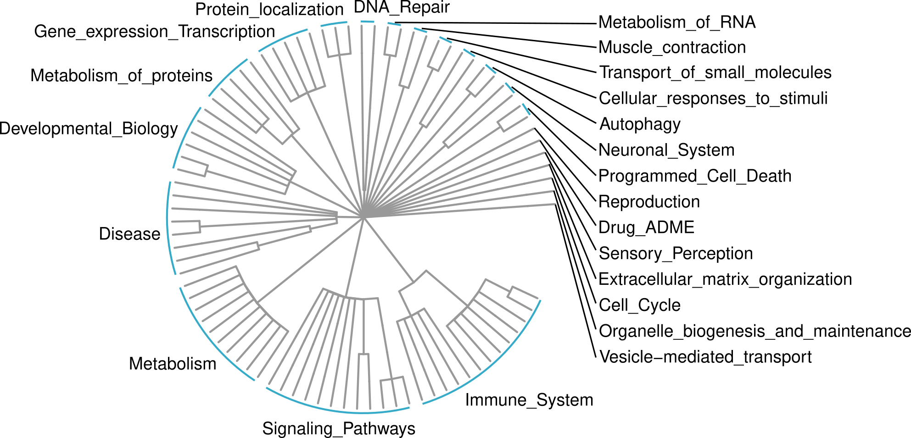

```{r setup, include = FALSE}
knitr::opts_chunk$set(echo = TRUE, fig.wide = TRUE)
```

# Introduction
Mitochondria are cellular organelles whose main role is related to the aerobic respiration to supply energy to the cell. In addition to this, they are also involved in other tasks, such as signaling, cellular differentiation, and cell death, as well as maintaining control of the cell cycle and cell growth. The dysfunction of mitochondria activity has been implicated in several human disorders and conditions. Studying mitochondrial behavior in health and disease conditions is opening new possibilities of understanding disease mechanisms and providing new treatments. Indeed, the possibility to target mitochondria for cancer therapies is increasingly becoming a reality in biomedical research.

The analysis of high resolution transcriptomic data can help in better understanding mitochondrial activity in relation to the gene expression dynamics. Even if a curated mitochondrial specific pathway resource exists (MitoCarta3.0, which provides a list of mitochondrial genes organized into mitochondrial pathways [1]) computational tools for mitochondrial-focused pathway analysis are still lacking. In the field of gene set analysis, general purpose resources are pathway databases, such as Reactome [5] and the Gene Ontology (GO) project [4], which aim at providing gene set categories for high-throughput data analysis for all the cellular contexts. In the vast majority of pathways contained in these public databases, the mitochondrial-specific component of cellular signaling constitutes only a small portion, which is often overshadowed by the non-mitochondrial signaling. And, even if the information on protein localization is present, pathway analysis typically does not account for whether the activated signal involves the mitochondrion or not.

Thus, we thought that a tool able to focus specifically on the mitochondrial part of pathways could allow tailored and more specific analysis on this interesting organelle and we started to develop mitology to provide actionable and fast mitochondrial phenodata interpretation of high-throughput data.

These vignete shows some ways to perform mitochondrial pathway analyses using mitology. Also, some visualization functions are implemented to visualize the scores. These can help in the result interpretations.

# Installation
To install this package:

```{r eval=FALSE}
if (!require("BiocManager", quietly = TRUE))
    install.packages("BiocManager")

BiocManager::install("mitology")
```

# Mitochondrial Genes
A list of mitochondrial genes was obtained by joining four public resources that were developed in the last years to define the mitochondrial proteome with the aim to study mitochondrial functions, dysfunctions and diseases. Specifically, we collected the genes from: MitoCarta3.0 [1], the Integrated Mitochondrial Protein Index (IMPI) [2], the Mitochondrial Disease Sequence Data Resource (MSeqDR) [3] and The Gene Ontology (GO) [4].

In MitoGenesDB table we can see the full list along with the database from with it was retrieved.

```{r}
library(mitology)
data(MitoGenesDB)
head(MitoGenesDB)
```

# Gene sets collected in mitology
## Gene sets from MitoCarta3.0
The whole and original structure from the MitoCarta3.0 database was kept and included in mitology organized in a three-tier hierarchy.


```{r, echo=FALSE, fig.wide=FALSE}
knitr::include_graphics("figures/MitoCarta_gene_sets.png")
# 
```


In addition to MitoCarta3.0, we decided to propose three more comprehensive mitochondrial-oriented gene set resources exploiting Reactome, GO Biological Processes (GO-BP), and GO Cellular Components (GO-CC).

## Gene sets from GO
We explored the GO-CC and GO-BP terms. To filter the GO terms we performed a four-steps selection. Firstly, terms were filtered by size, keeping all the ones with at least 10 mitochondrial genes. Then, we pruned the GO trees of CC and BP by the graph levels, filtering out the 0°, 1°, 2° and 3° levels and keeping the terms from the 4° level. Then, we tested the enrichment of the remaining sets for our mitochondrial gene list with the `enrichGO` function from the `clusterProfiler` R package (v4.14.3). Only sets with FDR lower than 0.05 have been passed to the next step. Finally, the last selection was topological, we exploited the GO hierarchical organization selecting the more general enriched gene sets filtering out their offspring terms.


```{r, echo=FALSE, fig.wide=FALSE}

# 
```


## Gene sets from Reactome
The Reactome pathways were retrieved with the `graphite` R package (v1.52.0). Reactome has a simpler structure with far less level of nested pathways, thus we applied only three filtering steps: number of mitochondrial genes over 10; FDR under 0.05 (enrichment computed with the `phyper` function) and filtering of the offspring pathways.


```{r, echo=FALSE, fig.wide=FALSE}

# 
```


Once we obtained the final terms and pathways respectively from GO and Reactome, we extracted the mitochondrial gene sets by keeping only the genes included in the mitochondrial list. The same names of the original terms/pathways were kept for the gene sets included in mitology. The final gene sets and the corresponding tree-structures of the four databases were kept and included in the mitology package.

# How to use mitology
## Access mitochondrial gene sets
The `getGeneSets` function allows to get the mitochondrial gene sets. It returns them for one of the four possible databases (MitoCarta, Reactome, GO-CC and GO-BP) by the `database` argument. The `nametype` argument says the type of gene name ID, either one of SYMBOL, ENTREZID or ENSEMBL. The `objectType` argument can be set to return the gene sets in form of a list or a data frame.

```{r, message=FALSE}
MC_df <- getGeneSets(
    database = "MitoCarta", nametype = "SYMBOL", objectType = "dataframe")

MC_list <- getGeneSets(
    database = "MitoCarta", nametype = "SYMBOL", objectType = "list")
```

## Enrichment analyses
In the following section, we use an example bulk expression dataset of ovarian cancer to show how to use `mitology` to perform an analysis of the mitochondrial activity.

```{r, message=FALSE}
# loading packages
library(SummarizedExperiment)
library(AnnotationDbi)
library(org.Hs.eg.db)
library(GSVA)
library(Biobase)
```

```{r}
# load data
data(ovse)
ovse
```

### Enrichment analyses of the mitochondrial gene sets
We can perform an over representation analysis with `enrichMito`.

```{r, warning=FALSE}
genes <- rownames(ovse)[elementMetadata(ovse)$PROvsIMR_FDR < 0.01]
genes <- mapIds(
    org.Hs.eg.db, keys = genes, column = "ENSEMBL",
    keytype = "SYMBOL", multiVals = "first")

enrichresMC <- enrichMito(genes = genes, database = "MitoCarta")
mitoTreePoint(data = enrichresMC, database = "MitoCarta", pvalCutoff = .9, color = "pvalue")

enrichresRT <- enrichMito(genes = genes, database = "Reactome")
mitoTreePoint(data = enrichresRT, database = "Reactome", pvalCutoff = .4, color = "pvalue")
```

We can also compute the gene set enrichment analysis with `gseaMito`.
```{r, warning=FALSE}
geneslFC <- elementMetadata(ovse)$PROvsIMR_logFC
names(geneslFC) <- rownames(ovse)
names(geneslFC) <- mapIds(
    org.Hs.eg.db, keys = names(geneslFC), column = "ENSEMBL",
    keytype = "SYMBOL", multiVals = "first")
geneslFC <- sort(geneslFC, decreasing = TRUE)
geneslFC <- geneslFC[!is.na(names(geneslFC))]

gsearesMC <- gseaMito(genes = geneslFC, database = "MitoCarta")
# mitoTreePoint(data = gseares, database = "MitoCarta", pvalCutoff = 1.1, color = "NES")

gsearesRT <- gseaMito(genes = geneslFC, database = "Reactome")
# mitoTreePoint(data = enrichres, database = "Reactome", pvalCutoff = .4, color = "NES")
```

Or also a single sample GSEA (ssGSEA) with `GSVA`.

```{r}
gsvaPar <- ssgseaParam(exprData = ovse, geneSets = MC_list)
res_ssGSEA <- gsva(gsvaPar)
```

## Visualization
When we obtain a matrix of scores for each sample in each gene set we can visualize it in an heatmap.

Since we obtained a single score for each cell and it would be difficult to visualize it, we can summarize the information of samples by taking the mean value for each OV subtype.

```{r}
res_ssGSEA_subtype <- do.call(
    cbind, lapply(unique(ovse$OV_subtype), function(x){
        rowMeans(assay(res_ssGSEA)[,ovse$OV_subtype==x])
    }))
colnames(res_ssGSEA_subtype) <- unique(ovse$OV_subtype)
rownames(res_ssGSEA_subtype) <- rownames(res_ssGSEA)
res_ssGSEA_subtype <- t(scale(t(res_ssGSEA_subtype)))
```

```{r fig.height=5.5, fig.width=4.5}
mitoHeatmap(data = res_ssGSEA_subtype, database = "MitoCarta")
```

```{r fig.height=5.2, fig.width=5.5}
mitoHeatmap(data = res_ssGSEA_subtype, database = "MitoCarta", splitSections = TRUE)
```

We can also visualize it by plotting a circular heatmap on the gene set tree hierarchy.

```{r, message=FALSE}
# mitoTreeHeatmap(
#     data = res_ssGSEA_subtype, database = "MitoCarta", 
#     labelNames = "leaves", font.size = 1)
```

It is possible to plot only the main section arguments instead of the single gene set names.

```{r, message=FALSE}
# mitoTreeHeatmap(
#     data = res_ssGSEA_subtype, database = "MitoCarta",
#     labelNames = "sections", font.size = 3)
```

These analysis can be done with the mitochondrial gene sets from Reactome, GO-CC and GO-BP.

# Additional functionalities
More tutorials and examples of other plots are available on an [extended tutorial on GitHub](https://github.com/CaluraLab/mitologyTutorials). 

# Bibliography
[1] Rath S, Sharma R, Gupta R, et al. MitoCarta3.0: an updated mitochondrial proteome now with sub-organelle localization and pathway annotations. Nucleic Acids Res 2020; 49:D1541–D1547

[2] Peck P. IMPI. 2021

[3] Shen L, Diroma MA, Gonzalez M, et al. MSeqDR: A Centralized Knowledge Repository and Bioinformatics Web Resource to Facilitate Genomic Investigations in Mitochondrial Disease. Hum Mutat 2016; 37:540–548

[4] The Gene Ontology Resource: 20 years and still GOing strong. Nucleic Acids Res 2019; 47:D330–D338

[5] Rothfels K, Milacic M, Matthews L, et al. Using the Reactome Database. Curr Protoc 2023; 3:e722

# Session Info
Here is the output of sessionInfo() on the system on which this document was compiled.

```{r}
sessionInfo()
```

